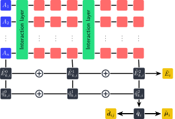

# TikZ code for HIPNN diagram

Pretty much as the title says.

`hipnn_diagram.tex` is everything about the figure, including the necessary
packages and setup. You directly paste this piece of code into your paper or
slides (if you are using Beamer or IguanaTex for PowerPoint).

`hipnn.tex` is an example to render a standalone figure as a pdf file, which can
be used independent of TeX. You can convert the pdf file to other formats as
needed.

Unfortunately, the code is not very modular, but should be straightforward
enough to read, especially if you read the code and the rendered figure side by
side. I will try to add more comments and explanation in the future.
